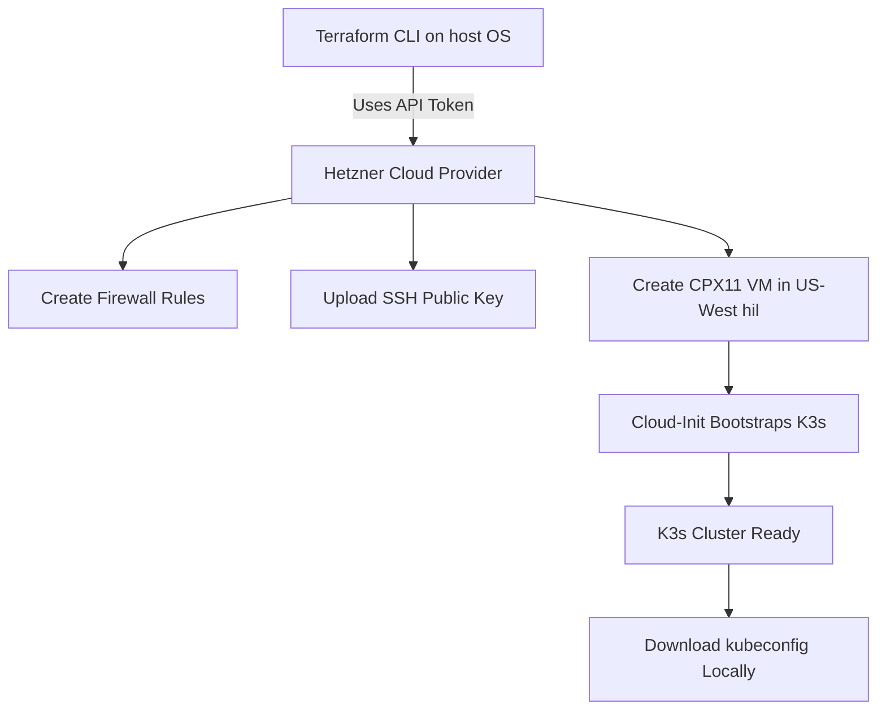

# K3s on Hetzner Cloud with Terraform

This project automates the provisioning of a **single-node K3s cluster** (lightweight Kubernetes) on **Hetzner Cloud** using Terraform.  
It handles everything from infrastructure creation to K3s installation, producing a ready-to-use Kubernetes control plane.

---

## What This Project Does

1. Uploads your SSH public key to Hetzner (or reuses an existing key).
2. Creates a firewall allowing SSH, ICMP, HTTP/HTTPS, and K3s API (6443).
3. Deploys a CPX11 instance in the US-West (Hillsboro) region.
4. Runs cloud-init to install and configure K3s automatically.
5. Outputs SSH access details and a command to retrieve kubeconfig for `kubectl`.

After apply, you can immediately manage your cluster locally with kubectl.

---

## Architecture Diagram



---

## Prerequisites

- Terraform v1.13 or newer
- Hetzner Cloud account and API token
- SSH key pair for access

---

## Deployment

1. **Generate SSH key**
   ```bash
   ssh-keygen -t ed25519 -C "hetzner-k3s" -f ~/.ssh/id_ed25519_hetzner
   ```

2. **Set environment variables**
   ```bash
   hcloud ssh-key list
   export TF_VAR_existing_ssh_key_name="hetzner-access"
   export HCLOUD_TOKEN # "your-hetzner-api-token"
   export TF_VAR_ssh_public_key_path=~/.ssh/id_ed25519_hetzner.pub
   
   echo "${HCLOUD_TOKEN:0:4}****${HCLOUD_TOKEN: -4}"
   echo $TF_VAR_ssh_public_key_path
   echo $TF_VAR_existing_ssh_key_name
   ```

3. **Deploy infrastructure**
   ```bash
   terraform init -upgrade
   terraform plan
   terraform apply -auto-approve
   ```

4. **Validate deployment**
   ```bash
   $(terraform output -raw kubeconfig_pull_cmd)
   export KUBECONFIG=$PWD/k3s.yaml
   kubectl get nodes -o wide
   kubectl get pods -A
   ```

5. **Verify idempotence**
   ```bash
   terraform plan -detailed-exitcode
   # expect exit code 0 (no changes). 2 means changes exist; nonzero in CI = fail
   ```

---

## Cleaning Up

```bash
terraform destroy -auto-approve
```